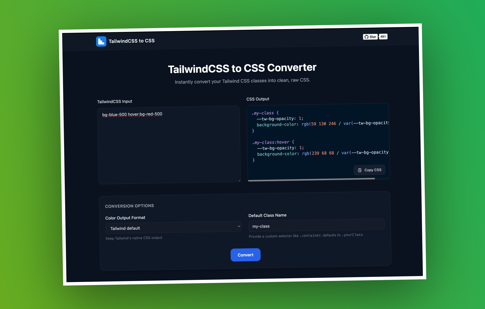

<p align="center">
  
</p>

<p align="center">
  <strong>TailwindCSS to CSS Converter</strong>
</p>

<p align="center">
  Modern reimagining of <a href="https://github.com/Devzstudio">Devzstudio</a>'s Tailwind to CSS utility – now with a refreshed UI, live syntax highlighting, and quality-of-life features for everyday workflow.
</p>

---

## Overview

TailwindCSS to CSS Converter is a Next.js app that turns Tailwind utility strings into clean, standards-friendly CSS. It keeps parity with Tailwind’s latest utilities by shelling out to the Tailwind runtime on the server, wrapping results in your preferred selector, and presenting everything in an accessible, dark-themed interface.

> ℹ️ This project is a community clone/remake of the original tool by [Devzstudio](https://github.com/Devzstudio). It preserves the spirit of their work while extending the feature set and polishing the developer experience.



## Features

- ✅ **Real Tailwind output** – Uses Tailwind’s own generator so every utility (colors, animations, arbitrary values) stays accurate.
- ✅ **Responsive & pseudo support** – Breakpoints (`sm` through `2xl`) and states (`hover`, `focus`, etc.) are automatically nested.
- ✅ **Custom selector** – Choose the class name that wraps the generated rules.
- ✅ **Color conversions** – Switch between Tailwind defaults, RGB, HEX (with alpha), or OKLCH with one click.
- ✅ **Syntax-highlighted CSS** – Instant highlighting powered by `prism-react-renderer` for easier scanning.
- ✅ **Persistent preferences** – Color format and default selector are stored in `localStorage` so they survive reloads.
- ✅ **Copy helpers** – One-tap copy button on the output pane.
- ✅ **Polished UX** – Responsive layout, keyboard-friendly controls, and toast feedback on copy/error.

## Getting Started

```bash
# install dependencies
pnpm install

# run in development mode
pnpm dev

# lint & type-check
pnpm lint

# production build
pnpm build
```

Open `http://localhost:3000` after running `pnpm dev` and drop in any Tailwind class string to see the formatted CSS.

## Tech Stack

- [Next.js 13](https://nextjs.org/) (App Router disabled)
- [React 18](https://react.dev/)
- [Tailwind CSS 3](https://tailwindcss.com/)
- [prism-react-renderer](https://github.com/FormidableLabs/prism-react-renderer) for syntax highlighting
- [Culori](https://culorijs.org/) for color-space conversion

## Project Structure Highlights

- `pages/index.tsx` – Main UI with conversion controls and highlighted output
- `pages/api/convert.ts` – Server route that invokes Tailwind’s generator
- `libs/helpers.ts` – Conversion orchestration, pseudo/breakpoint handling, color formatting
- `components/CodePreview.tsx` – Highlighted code block wrapper

## Acknowledgements

- Inspired by and rebuilt from [Devzstudio](https://github.com/Devzstudio)’s original Tailwind To CSS converter. 🙌
- Icons courtesy of [Heroicons](https://heroicons.com/).

## Support

If this remake helps your workflow, consider starring the repo or sharing it with your team. Contributions, ideas, and feedback are very welcome—open an issue or submit a PR! 🚀

